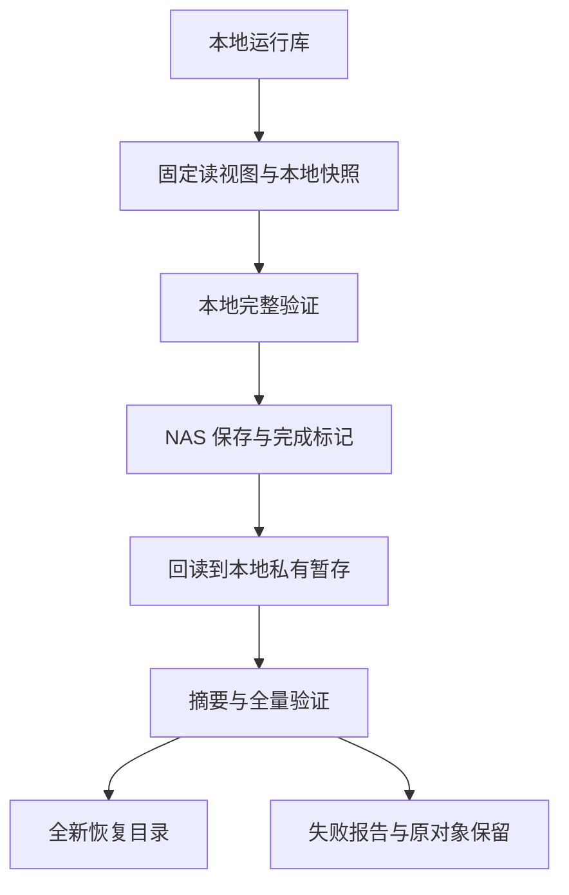

# A2 架构：本地一致快照与挂载存储适配

状态：**Candidate；A2 Gate OPEN**。Decision Authority：Owner。需求见 [REQUIREMENTS](REQUIREMENTS.md)，字段与状态的唯一规范见 [INTERFACE_PROFILE](INTERFACE_PROFILE.md)。本文不替代 A1 架构。

## 1. 责任与数据流

| 组件 | 主责任 | 不拥有的责任 |
|---|---|---|
| recovery 库/CLI | create/publish/verify/restore/check-restore | 调度、消费者切换、知识审核 |
| SQLite snapshot | 固定源视图、Online Backup、格式与 Ledger 验证 | NAS 登录、跨实现转换 |
| Snapshot envelope | 数据文件、manifest、完成标记的字节绑定 | 来源签名、Artifact 身份 |
| mounted-posix-v1 adapter | 挂载核对、独占目录、有界复制、同步/回读、拒覆盖 | NAS 管理、未测的服务端断电保证 |
| 运维配置/验收 | 路径、挂载、预期摘要保管、操作窗口 | 修改不可变记录 |

依赖为消费者 → recovery → SQLite/文件系统适配；A1 普通读写不依赖 NAS。首版模块留本仓；未来第二传输实现须保持合同并单独验证。

## 2. 一致性与源保护

使用专用 SQLite 只读连接，正确转义 URI 路径；活跃源不用 immutable 模式绕过锁。查询并确认 schema/profile/journal/UTF-8编码，不改 journal、不转码、不迁移。需要 hot-journal 恢复的源拒绝本次快照，由正常 Ledger 生命周期先恢复，快照程序不修复源。

显式开始只读事务并首次真实读取建立 T0，在同一视图检查格式/预算，调用标准库 Connection.backup 到本地独占暂存库。源和目标不同连接，目标无已开启事务；正数 pages 分步复制，progress 按单调时钟检查期限和目标页预算。只认 backup 完整成功，不能仅因 close/finish 未报错判成功。

DELETE 读锁可能延迟其他连接提交，部署者安排维护窗口。backup 完成或失败即关闭连接、释放源事务，随后才做深度验证和 NAS 搬运。并发测试通过握手确认 T0 前提交包含、T0 后提交不混入；墙钟日期不作为提交时间证明。

SQLite 说明分步 backup 可能因其他写入重启；固定读事务和检查点预算防止把 busy_timeout 当总时限。OS 阻塞 I/O 不受 Python 检查硬限制。[SQLite backup](https://www.sqlite.org/backup.html)、[C API](https://www.sqlite.org/c3ref/backup_finish.html)、[Python 3.11 backup](https://docs.python.org/3.11/library/sqlite3.html#sqlite3.Connection.backup)。

## 3. 验证、封存与预算

顺序为有界成员检查 → SQLite 格式/schema/profile/UTF-8编码 → 预算 → 完整 integrity_check 仅返回 ok → foreign_key_check 无行 → Ledger.verify 检查关系、索引与全部 Blob。SQLite 完整性检查不覆盖全部外键和业务不变量。[SQLite PRAGMA](https://www.sqlite.org/pragma.html#pragma_integrity_check)。

现有 verify 汇集 metadata/refs 到内存，因此先在同一只读视图确认PRAGMA encoding为UTF-8，再用SQL BLOB长度统计字节和行数，随后解码；每份私有验证/恢复副本也先检查编码，不能仅信manifest自报。非UTF-8按接口拒绝，不转换后冒充原字节。Blob 按既有单体上限逐个验证；复制/hash 使用固定块。不承诺无限库、流式全图验证或固定 RSS。

关闭目标所有 SQLite 连接，确认无 sidecar 后，对封存文件计算长度/hash并生成 manifest。活跃源文件调用前后的 hash 不是验收基准；后续搬运和首次恢复匹配这一份封存 bytes。需要可写打开的现有 Ledger 验证只在本地私有副本进行，NAS 文件不作为 SQLite 运行库打开。

## 4. NAS 发布与存储能力

首版 mounted-posix-v1 要求 Linux 挂载目录具有独占 mkdir/文件创建、同 FS 硬链接拒覆盖、文件及目录 fsync、关闭后重开读取，且每代目录由一个受信发布者独占。真实 NAS 必须实测；品牌或 SMB/NFS 名称不是支持证明。使用该最小 profile 复用现有拒覆盖原则；不满足则返回不支持，后续另立适配方案。

配置固定 storage_ref、mount_point、mount_root、fs_type、mount_source、archive_root；入口按接口取得并验证自有配置副本，后续挂载核对和发布使用同一份固定值。Linux mountinfo 核对目标最深匹配挂载和本轮 mount ID，目录 fd 的 `/proc/self/fdinfo` mnt_id 必须对应；文件操作相对固定目录 fd 并逐层拒符号链接。在复制前、发布 marker 前、最终回读后复核路径/inode和挂载绑定；根目录存在、IP可访问或st_dev不同均不足够。非预期子挂载、root不符和overlay拒绝；挂载消失不能回退到下面的本机目录。

mountinfo不能可靠证明一次挂载是否由完整根bind产生；本profile绑定已确认的source/type/point/root及本轮mount ID，不声称识别所有bind。子树重挂载等可见不一致必须拒绝；预期端点配置由部署者确认，不能由程序自行猜测。

mountinfo字段与fdinfo的mnt_id对应关系依据 [Linux内核proc文档](https://docs.kernel.org/filesystems/proc.html)；mount ID可能在卸载后重用，因此必须同时检查端点字段和所持fd，不只比较一个数字。

mkdir 独占 snapshot_id 目录，存在即拒绝。复制经过验证的 DB/manifest，fsync文件、关闭、重新打开核对长度/hash，再同步 generation/parent。marker 在同挂载独占暂存目录生成并 fsync，用 hardlink 发布为 COMMITTED.json，禁止覆盖；最后 fsync generation/parent 并核对三成员。暂存位于 generation 外，完成代只有三个规定成员。

marker 可见后同步、回读或挂载核对失败，报告 unknown，不能称未发布或自动删除。读取者必须验证 marker、manifest、数据；marker 单独存在无效。完整且有效的三成员在发布者最后目录同步前也可能被verify读到并验证通过；这只证明当前可读自洽，不等于发布者已完成同步或可返回published。核对原ID和独立保存的摘要不能证明之前同步成功；观察到缺失也不能授权覆盖重试。已尝试但能证明没有产生公开对象的失败按接口not_published处理；NAS不确定结果不能降为该状态。

create首次响应丢失时可能没有事先保存的manifest hash；按[接口结果合同](INTERFACE_PROFILE.md#5-结果与失败合同)只读检查本次独占目录的自洽性并明确较弱证据边界，不能将事后读取的摘要冒充先前预期值。

系统调用确认和重新读取不证明 NAS 缓存/供电/介质在断电后必然保持；支持声明限定到实际验证的系统栈。[SQLite 网络存储边界](https://www.sqlite.org/useovernet.html)、[Python fsync](https://docs.python.org/3.11/library/os.html#os.fsync)。

## 5. 恢复与结果不明

调用者提供独立保存的预期 manifest hash。归档读取固定目录/文件 fd，拒链接和非普通文件；从同一数据 fd 分块复制/hash到本地私有暂存，验证这一份暂存。禁止验证路径后重新打开另一对象。修改、短读/超长、hash不符拒绝；这是受信存储内的误操作/竞争防护，不是管理员篡改或签名认证方案。

restore 原子 mkdir 全新目标目录；已存在任何对象（含空目录、断链）均拒绝。固定恢复文件 ledger.sqlite；返回成功前不交给消费者，目录内只允许本次操作写，避免 sidecar 竞争。最终暂存与目标同 FS，验证、关闭、复查hash、fsync后hardlink拒覆盖发布；移除本次私有暂存文件/子目录后，再同步目标目录和父目录、核对inode及最终目录仅剩ledger.sqlite。清理必须先于最终目录同步；失败保留已公开目标，不删除目标来伪装回退。

link后清理/同步/响应失败，用 check_restore 在尚未启用业务写入的目标上比对原数据库hash并完整验证；遗留私有暂存和link count大于1不单独使此核对失败，SQLite sidecar则按接口拒绝。其他目录成员不遍历或清理，OK仅证明数据库，不声称目录已清理或可以启用。核对不写目标，也不伪称过去同步成功。应用已写入则不能再用整文件hash认证初次恢复，返回不匹配并保留现场。暂存清理和是否切换消费者由调用方另行决定。

## 6. 演化与选择

物理快照绑定 schema 1，与 portable JSON 分开版本化。恢复不经 import，不增加业务记录；未知格式拒绝，无自动迁移。A2拟增模块/子命令和版本0.2.0a1；A1 metadata candidate、schema及既有命令保持。

SQLite WAL-reset 官方问题涉及 WAL 并发写/检查点。本提案维持 DELETE 并拒 WAL，不照搬其他项目的 WAL 方案；GX10 SQLite3.45.1 的 A1 结果不等于 A2 已验。未来启用 WAL 另行复核。[官方说明](https://www.sqlite.org/wal.html#walreset)。

schema、幂等历史和恢复不变量归 Ledger，因此 snapshot 模块留本仓。其他项目的方法可对账，但私有模型、未合并实现与格式不是依赖；本提案不复制其正文或代码。通用传输组件只有形成独立生命周期/第二使用者证据后再提炼。
